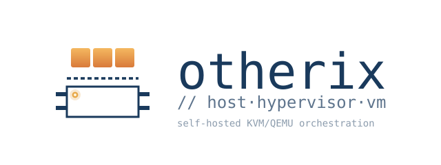

<picture>
  <source media="(prefers-color-scheme: dark)" srcset="assets/brand/banner-dark-strip-transparent.svg">
  
</picture>

# Otherix

Open-source self-hosted control plane for managing virtual machines on
KVM/QEMU clusters.

Otherix runs VMs on a fleet of bare-metal nodes, each controlled by an
Otherix agent that talks to QEMU directly (no libvirt). The control
plane (`otherix-api`) — REST API with in-process scheduler and
reconciliation loops — keeps the cluster's desired state in an embedded
etcd member; agents report observed state through heartbeat. The split mirrors the
Kubernetes pattern: declarative API, generation/observed-generation
bookkeeping, reconciliation loops.

The differences come from the workload. VMs are long-lived stateful
entities, not cattle. Disks persist. Identities are stable.
Live migration is a first-class operation that runs peer-to-peer
between agents, with the control plane out of the data path. Storage
pools, networks, and firmwares are explicit cluster resources rather
than abstractions over a cloud provider. VMs are created directly from
an image URL, and snapshots are managed primitives, not afterthoughts.

Otherix is built to be deployed in your own datacentre or homelab.
The control plane ships as standalone binaries that run directly on
a host - either a dedicated control-plane host, or the same host
that runs an agent for single-node installations. Agents install on
each KVM/QEMU host as a single binary alongside qemu-system-*. No
external dependencies: the api-server runs its own embedded etcd member,
so there is no separate database, queue, or cache to operate.

## Status

Early development.

## Development

Otherix is developed with a clear separation of responsibilities
between human authorship and AI assistance:

- **Human-authored:** architecture, technical decisions, API and
  schema design, code review, roadmap, and overall project
  direction.
- **AI-assisted:** implementation of code and tests within the
  boundaries set by those decisions, drafting of routine
  documentation, and refactoring under review.

Every commit is reviewed by a human before merging. AI assistants
operate against the conventions in [CONTRIBUTING.md](CONTRIBUTING.md).

## Architecture

Otherix ships two daemons and an operator CLI.

**Daemons (cluster components):**

- **`otherix-api`** — REST API for users, the CLI, the web UI, and agents.
  Hosts in-process VM placement scheduling, reconciliation loops, and the
  in-process worker dispatcher that drains an etcd-backed job queue for
  background work. Embeds its own etcd member; designed for HA — replicas
  form a single self-clustering etcd cluster and coordinate through it.
- **`otherix-agent`** — runs on each KVM/QEMU host; manages local
  virtualization, communicates with the control plane via mTLS.

**Operator CLI:**

- **`otherix`** — command-line client for operators, scripts, and dev
  workflows. Not a cluster component; installed wherever an operator
  runs commands.

The control plane runs as standalone binaries with no external state
store - etcd is embedded in the api-server. Agents run on bare-metal
hosts. Authoritative architecture records live in [`docs/`](docs/).

## Quick start (local development)

The fastest path is the one-shot wrapper that brings up the entire
dev stack (control plane with embedded etcd + agent + CLI configuration)
in a single command:

```bash
make local-dev-start
# When done, tear everything down (DESTRUCTIVE - wipes the embedded-etcd data dir):
make local-dev-stop
```

After `local-dev-start` finishes, `./bin/otherix` works against a
fresh cluster with no further setup. The default admin is seeded
from `OTHERIX_BOOTSTRAP_ADMIN_EMAIL` / `OTHERIX_BOOTSTRAP_ADMIN_PASSWORD`
(defaults: `admin@otherix.local` / `correct-horse-battery-staple`).

Verify the cluster:

```bash
curl http://localhost:8080/healthz
# {"status":"ok","version":"dev"}

./bin/otherix node list
# NAME      ARCHITECTURE  STATUS  CORDONED  AGE
# node-mvp  <arch>        ready   no        20s
```

Browse the API in a browser:

```bash
make api-preview
# Swagger UI: http://localhost:8081
# Redoc:      http://localhost:8082
```

The one-shot wrapper dispatches to per-OS pipelines. On Linux the
agent runs as a per-user systemd unit on the host; on macOS the
agent runs inside a [Lima](https://lima-vm.io) VM (the agent itself
is Linux-only, the control plane runs natively on macOS). See
[docs/macos-development.md](docs/macos-development.md) for the macOS
workflow and rationale. Lower-level targets
(`bootstrap-dev` / `run-api-dev` / `seed-mvp` / `deploy-dev` /
`clean-dev`) are documented below.

## Linux dev environment

The agent runs natively on Linux as a per-user systemd unit. The
control plane runs from the same host and embeds its own etcd member,
so there are no dev dependencies to bring up first. Cert material
reaches the agent through the join-token bootstrap protocol, not manual
cert generation — `make seed-mvp` orchestrates the full flow end-to-end.

```bash
# 1. Stage the agent: build, install user systemd unit at
#    ~/.config/systemd/user/otherix-agent.service. The agent is NOT
#    started — the bootstrap protocol provisions cert material first.
make bootstrap-dev

# 2. (separate terminal) run the control plane against the dev config.
#    The api-server boots its own embedded etcd member (dev data dir
#    under .local/etcd). First-time only: seed the bootstrap admin via
#    env vars before start.
export OTHERIX_BOOTSTRAP_ADMIN_EMAIL=admin@otherix.local
export OTHERIX_BOOTSTRAP_ADMIN_PASSWORD='correct-horse-battery-staple'
make run-api-dev

# 3. Bootstrap the agent end-to-end — mints join token, provisions
#    bootstrap material, starts the agent, waits for the node row to
#    appear, seeds the default pool. VMs are created directly from
#    an image URL (otherix vm create --image-url ... --arch ...).
make seed-mvp

# 4. Verify the node is reachable (heartbeat is the canonical proof).
./bin/otherix node list

# 5. Daily redeploy after agent code changes
make deploy-dev

# 6. Tail agent logs
journalctl --user -u otherix-agent -f

# 7. Tear down (also wipes the embedded-etcd data dir)
make clean-dev
```

Cluster CA + per-replica CP server cert auto-generate inside the api
binary on first boot. The agent's cert material
is installed to `~/.config/otherix/certs/`. KVM is required for real
VM workloads — verify with `ls /dev/kvm` before relying on the dev
environment.

## macOS dev environment

See [docs/macos-development.md](docs/macos-development.md). The same
`make bootstrap-dev` / `deploy-dev` / `clean-dev` targets dispatch to
a Lima-based pipeline (Ubuntu 24.04 VM, system systemd unit, agent
reachable from the host via the 127.0.0.1:9443 port forward).

## Build

```bash
make build                  # daemons + CLI for the current platform
make build-api              # single daemon binary
make build-cli              # operator CLI binary
make build-linux-amd64      # cross-compile daemons for linux/amd64
make build-linux-arm64      # cross-compile daemons for linux/arm64
```

## Storage

State lives in the embedded etcd member the api-server starts in-process.
There is no schema and no migration step: `internal/etcdstore` enforces
structure application-side over the etcd key space (primary keys,
uniqueness guards, secondary indexes, and the job queue). `internal/store`
is a pgx-free type layer - the row / params / result structs and error
sentinels shared by the handlers and the store.

Integration tests embed an etcd member in-process (no Docker):

    make test-etcd         # internal/etcdstore + tests/apie2e (build tag: integration)
    make etcd-reset        # wipe the dev embedded-etcd data dir for a clean slate

## Layout

```
cmd/{api,agent,cli}/                     # binary entry points
internal/                                # private packages
  api/ agent/                            # per-daemon packages
  scheduler/ reconciler/                 # in-process control-plane logic
  auth/ config/ logger/ version/         # shared base packages
  etcd/ etcdstore/                       # embedded etcd member + the control-plane store
  worker/                                # job dispatcher + periodic scheduler
api/openapi/                             # Control Plane + Agent API specs
internal/store/                          # pgx-free type layer (row / params / result structs)
deploy/                                  # Dockerfiles, example configs
docs/                                    # architecture, plans
```

## Contributing

See [`CONTRIBUTING.md`](CONTRIBUTING.md) for project conventions
and development practices.

## License

Otherix is licensed under the Apache License, Version 2.0.
See [LICENSE](LICENSE) for the full text.

Copyright 2026 Andrei Taranik.
